# 📐 VectorLab ℝ² — Calculadora y Visualizador Gráfico de Vectores

[](https://developer.mozilla.org/es/docs/Web/JavaScript)
[](https://developer.mozilla.org/es/docs/Web/API/Canvas_API)
[-1572B6?logo=css3&logoColor=fff)](https://developer.mozilla.org/es/docs/Web/CSS)
[](#-arquitectura-del-sistema)
[](#-persistencia-local-de-ejercicios)
[](LICENSE)

> Suite científica de cálculo vectorial, simulación gráfica interactiva y resolución analítica paso a paso en el espacio euclídeo bidimensional ($\mathbb{R}^2$). Desarrollada bajo principios estrictos de **Clean Architecture**, **Domain-Driven Design (DDD)** y un motor gráfico vectorial en **HTML5 Canvas 2D**.

---

## 🎯 Descripción General

**VectorLab ℝ²** es una herramienta de ingeniería y aprendizaje matemático interactivo diseñada para resolver problemas de álgebra lineal y geometría analítica plana. La aplicación proporciona un entorno gráfico dinámico de alto rendimiento para modelar cadenas de puntos, operaciones algebraicas de vectores concurrentes, comprobaciones formales de equipolencia, y un modo interactivo de autoaprendizaje con persistencia local.

Diseñada con un enfoque de **cero dependencias externas**, explota las capacidades nativas del navegador para ofrecer renderizado fluido a 60 FPS con transformaciones de coordenadas en tiempo real (zoom, pan, centrado y control multicapa).

---

## 📸 Demostración Visual y Galería de la Suite

> Vista general del simulador vectorial en tiempo real con motor Canvas 2D acelerado, controles multicapa, formulario de coordenadas con steppers numéricos estilizados y cálculo continuo de vectores resultantes:

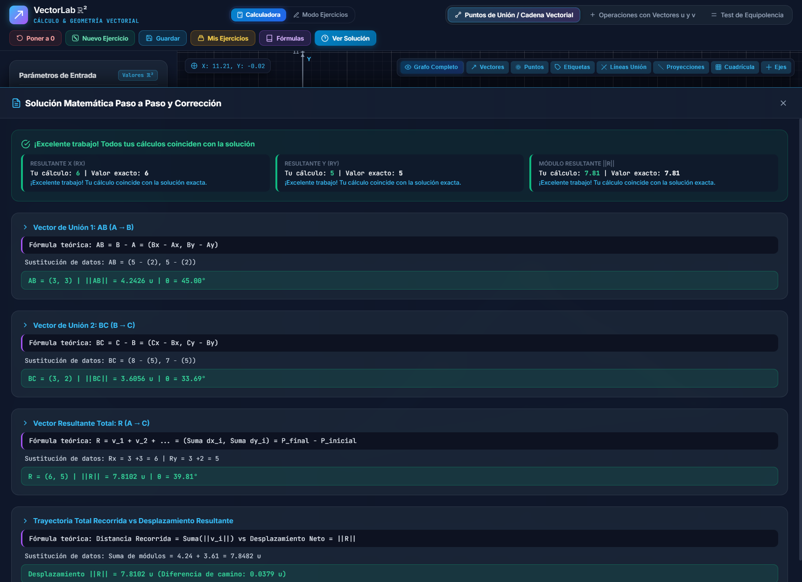

### 🧩 Módulos y Modos de Trabajo

| 1. Álgebra Concurrente (Regla del Paralelogramo) | 2. Diagnóstico Formal de Equipolencia |
| :---: | :---: |
| 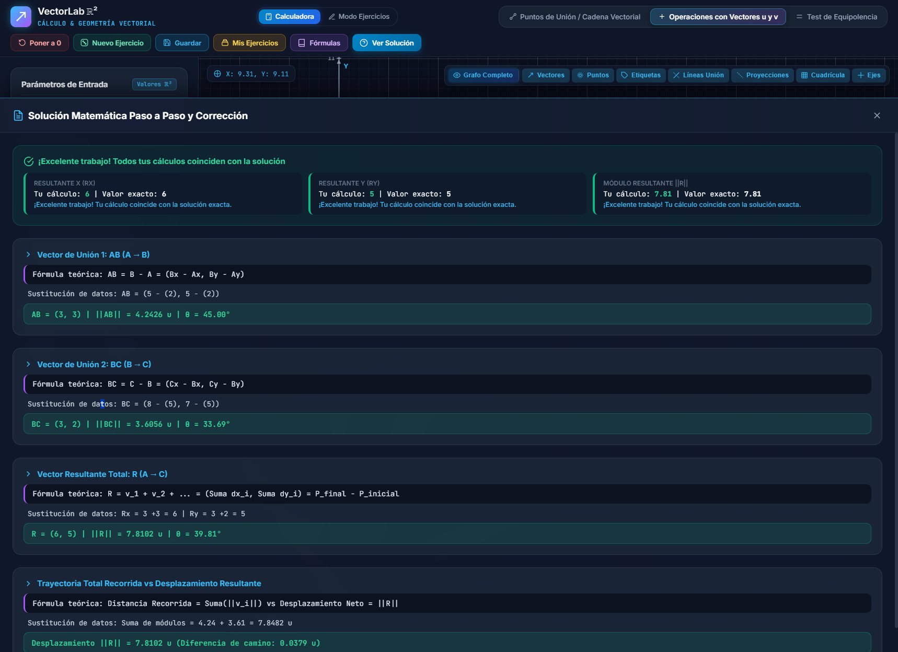 | 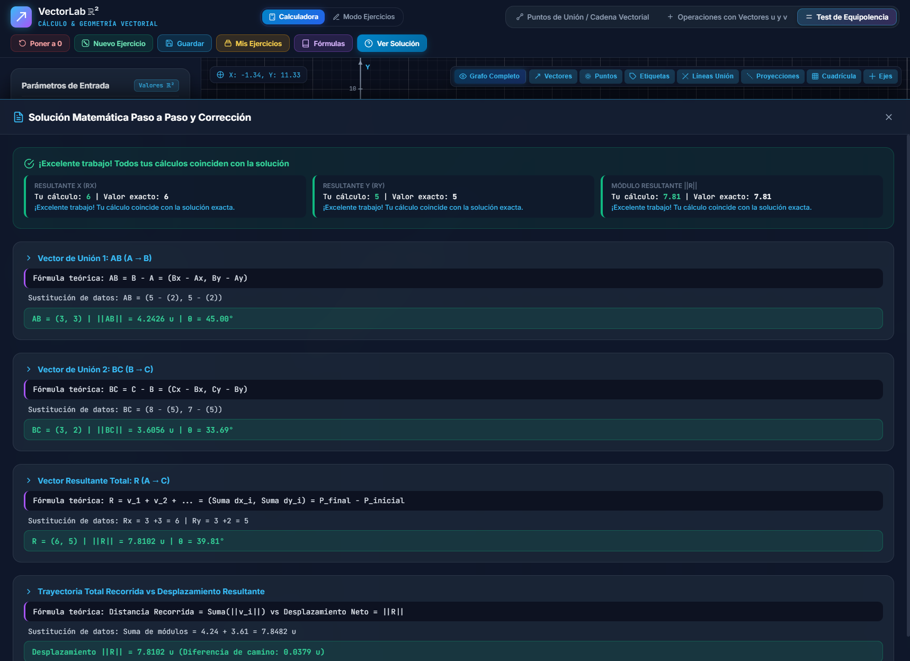 |
| **3. Modo Ejercicios y Autoevaluación** | **4. Solucionario Matemático Paso a Paso** |
| 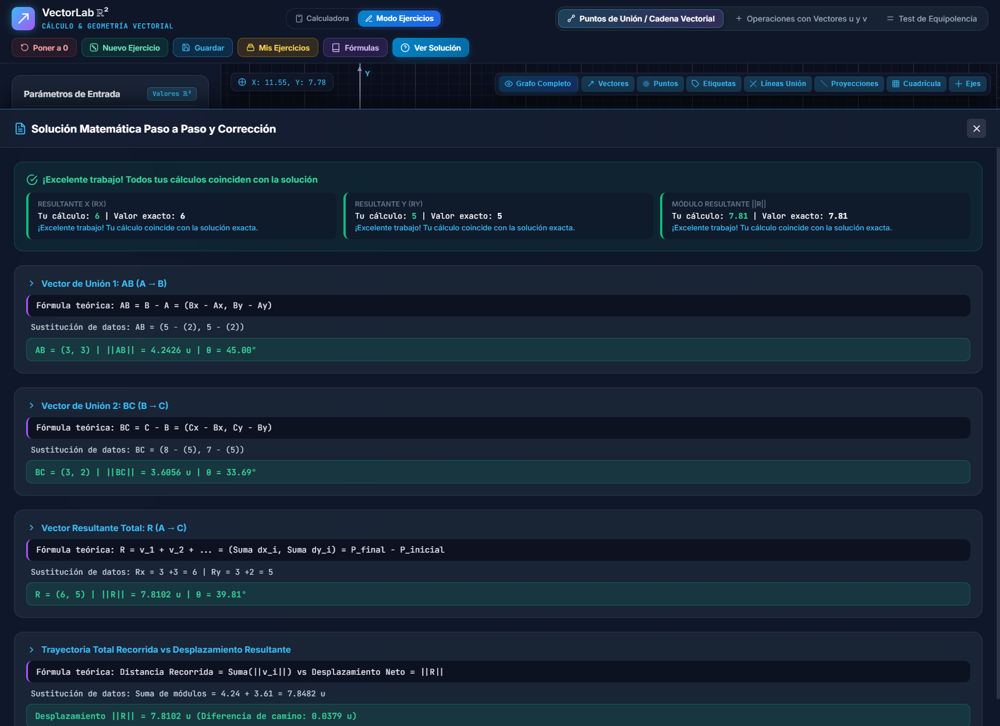 | 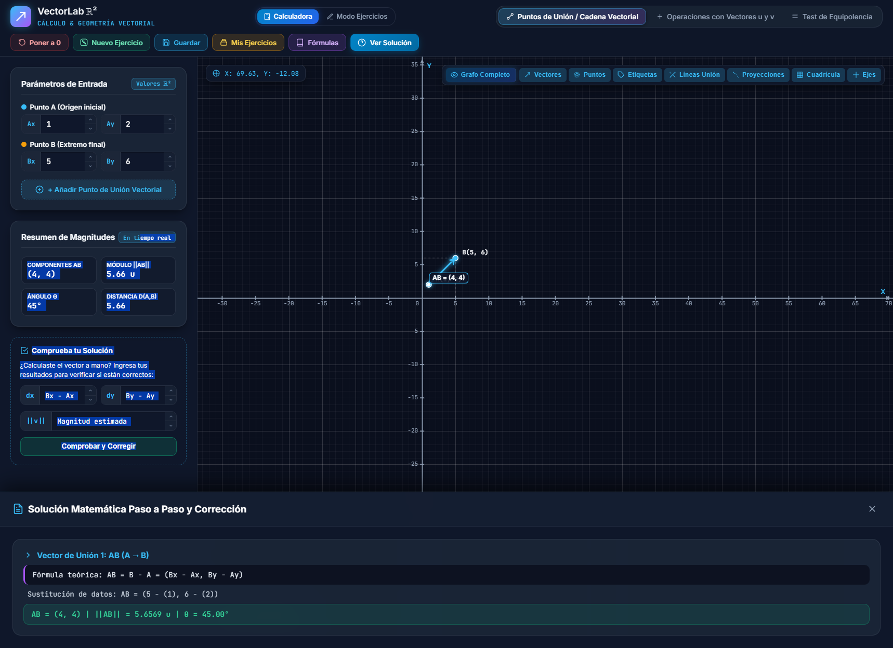 |
| **5. Compendio Teórico de Fórmulas** | **6. Catálogo de Ejercicios en LocalStorage** |
| 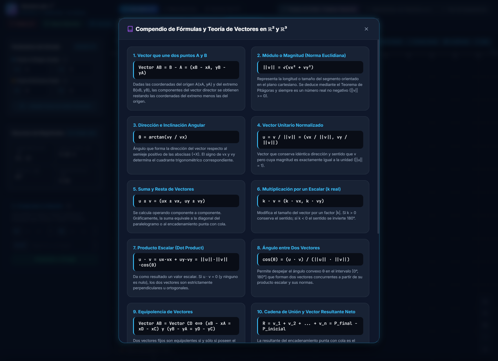 |  |
| **7. Guía Teórica y Lógica Matemática en ℝ²** | **8. Popovers de Información Contextual ("ℹ")** |
| 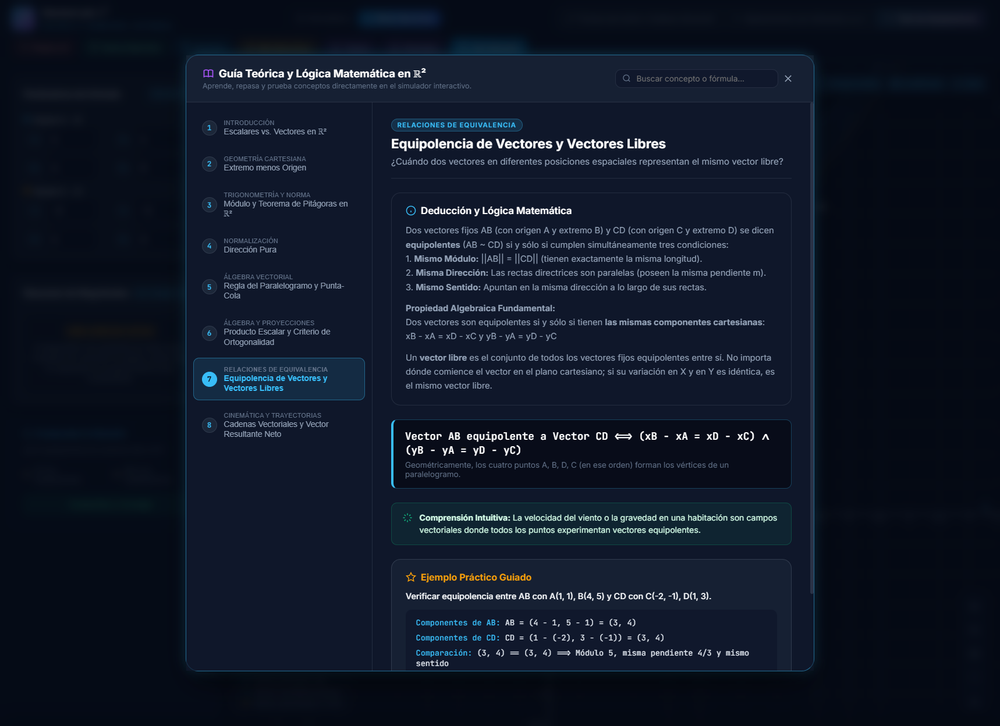 | 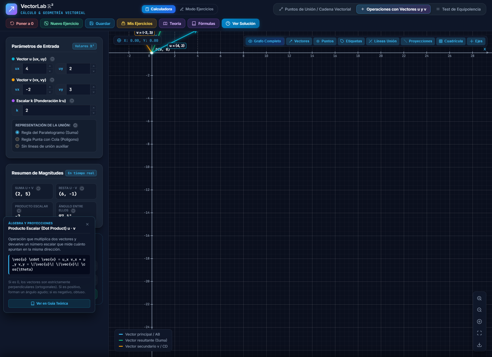 |
| **9. Espacio 3D ℝ³: Producto Vectorial u × v** | **10. Espacio 3D ℝ³: Puntos A→B & Cosenos Directores** |
| 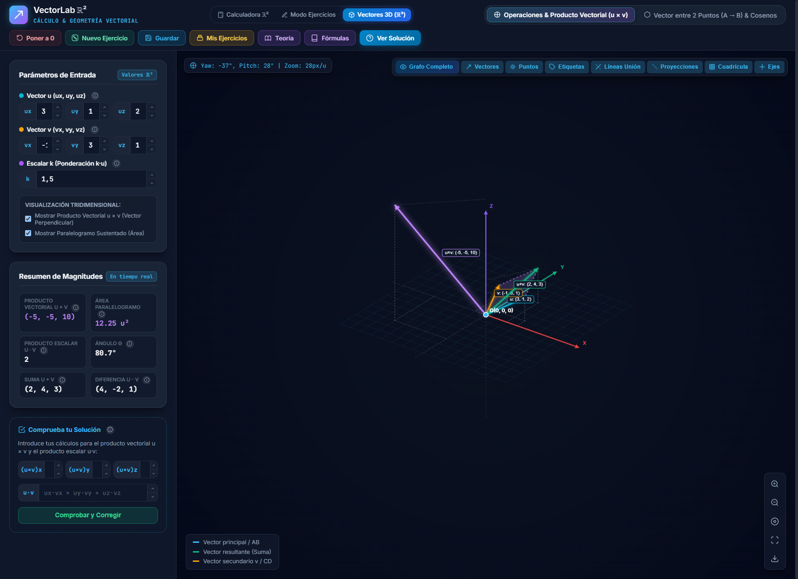 | 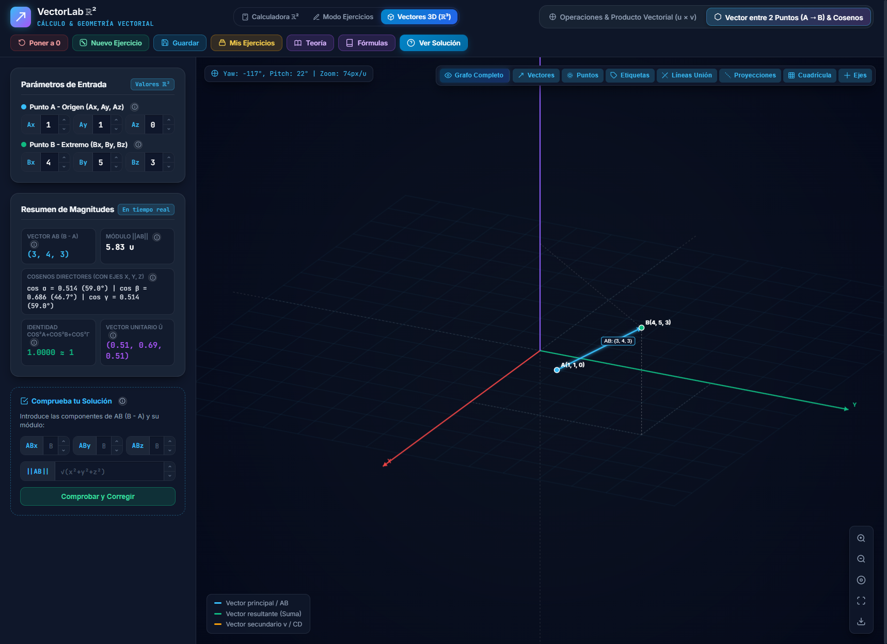 |

---

## ✨ Características Principales

### 1. Cadenas de Puntos y Vectores Consecutivos ($A \to B \to C \to \dots$)
- Generación de rutas continuas con puntos dinámicos identificados alfabéticamente.
- Cálculo analítico de componentes $\vec{v} = (x_2 - x_1, y_2 - y_1)$, norma euclídea $\|\vec{v}\|$, dirección angular $\theta$ y vector unitario director $\hat{u}$.
- Determinación automática del **Vector Resultante Global** $\vec{R} = \vec{v}_1 + \vec{v}_2 + \dots + \vec{v}_n$.
- Adición y supresión dinámica de nodos con re-indexación automática.

### 2. Álgebra de Vectores Concurrentes
- Operaciones directas entre vectores libres concurrentes $\vec{u}$ y $\vec{v}$:
  - **Suma vectorial:** $\vec{u} + \vec{v}$ con representación de la regla del paralelogramo.
  - **Resta vectorial:** $\vec{u} - \vec{v}$ y $\vec{v} - \vec{u}$.
  - **Producto por escalar:** $k \cdot \vec{u}$ con factor de escala ajustable.
  - **Producto escalar (dot product):** $\vec{u} \cdot \vec{v} = u_x v_x + u_y v_y$.
  - **Ángulo entre vectores:** $\theta = \arccos\left(\frac{\vec{u} \cdot \vec{v}}{\|\vec{u}\| \|\vec{v}\|}\right)$ expresado en grados y radianes.

### 3. Diagnóstico Formal de Equipolencia
- Comparación matemática exhaustiva entre dos vectores dados por sus extremos: $\vec{AB}$ y $\vec{CD}$.
- Verificación triple:
  1. **Mismo Módulo:** $\|\vec{AB}\| = \|\vec{CD}\|$ (tolerancia $\varepsilon = 10^{-6}$).
  2. **Misma Dirección:** Pendientes idénticas o paralelismo estricto.
  3. **Mismo Sentido:** Coincidencia en el vector unitario director $\hat{u}_{AB} = \hat{u}_{CD}$.

### 4. Modo Práctica y Retos con Autoevaluación a Ciegas (2D y 3D)
- Arquitectura de navegación jerárquica:
  - **Selector de Flujo:** Alternancia directa entre **Modo Calculadora** (tiempo real, valores visibles) y **Modo Ejercicios** (problemas con soluciones ocultas).
  - **Selector de Espacio:** Conmutación entre **Plano 2D (ℝ²)** y **Espacio 3D (ℝ³)**.
- En **Plano ℝ²**: Genera retos aleatorios de cadenas vectoriales, álgebra de operaciones y test de equipolencia.
- En **Espacio ℝ³**: Genera retos tridimensionales de producto vectorial $\vec{u} \times \vec{v}$, producto escalar, módulo y cosenos directores con puntos espaciales.
- Formulario de comprobación dinámica:
  - Comparación numérica con tolerancia estricta ($\varepsilon = 0.05$).
  - Badges de estado (*Válido* / *Discrepancia detectada*) con indicación del error y retroalimentación pedagógica.
  - Opción de desvelar el solucionario algebraico completo con sustitución paso a paso.

### 5. Control Multicapa del Grafo Cartesiano (HUD)
- **Interruptor Maestro (`#btn-toggle-todo`):** Oculta o visibiliza de forma global todos los elementos geométricos con un solo clic.
- **Filtros de Capa Independientes:**
  - Vectores directores y cabezas de flecha.
  - Nodos circulares de puntos de unión.
  - Cajas flotantes de etiquetas de texto y nombres.
  - Líneas auxiliares de construcción geométrica (paralelogramos y proyecciones).
  - Proyecciones ortogonales a los ejes coordenados.
  - Malla / cuadrícula mayor y menor.
  - Ejes directores principales $X$ e $Y$.
- Controles de cámara: Centrado automático de vista y reseteo de escala.

### 6. Cajón Analítico de Solución Paso a Paso
- Panel deslizante no obstructivo con desglose algebraico formal:
  - Enunciado del problema y datos de partida.
  - Fórmulas universales aplicadas.
  - Sustitución algebraica paso a paso.
  - Resultado final simplificado con redondeo configurable.

### 7. Persistencia Local de Ejercicios (`LocalStorage`)
- Guardado de estados completos de ejercicios con marcas de tiempo legibles y badges por categoría.
- Carga instantánea que conmuta el simulador al modo ejercicio con los datos restaurados.
- Eliminación individual o vaciado completo de la base de datos local del navegador.

### 8. Guía Teórica y Lógica Matemática Interactiva (ℝ² y ℝ³)
- **Selector de Dimensión con Botones Dedicados:**
  - `[📐 Plano ℝ²]`: Filtra y expone los fundamentos, deducciones y álgebra vectorial en el plano bidimensional.
  - `[🧊 Espacio ℝ³]`: Filtra y expone el álgebra espacial tridimensional, cosenos directores, producto vectorial, producto mixto y sistemas de proyección técnica.
- **Compendio Exhaustivo de 12 Módulos Temáticos de Dominio:**
  1. **Escalares vs. Vectores (ℝ²):** Magnitudes con dirección y sentido vs. valores unidimensionales.
  2. **Componentes Cartesianas (ℝ²):** Deducción del vector $\vec{AB} = B - A$ (extremo menos origen).
  3. **Módulo y Pitágoras (ℝ²):** Demostración analítica de la norma euclídea $\|\vec{v}\| = \sqrt{v_x^2 + v_y^2}$.
  4. **Vector Unitario y Normalización (ℝ²):** Extracción de la dirección pura $\hat{u} = \vec{v} / \|\vec{v}\|$.
  5. **Álgebra Concurrente (ℝ²):** Reglas del paralelogramo y punta-cola para suma y resta geométrica.
  6. **Producto Escalar y Ortogonalidad (ℝ²):** Proyección ortogonal y criterio de perpendicularidad ($\vec{u} \cdot \vec{v} = 0$).
  7. **Equipolencia y Vectores Libres (ℝ²):** Relación de equivalencia y traslación rígida en el plano.
  8. **Cadenas Vectoriales y Desplazamiento (ℝ²):** Suma secuencial y equivalencia cinemática del desplazamiento directo.
  9. **Expresión Cartesiana y Cosenos Directores (ℝ³):** Base canónica $\{\vec{i}, \vec{j}, \vec{k}\}$, ángulos directores $\alpha, \beta, \gamma$ e identidad pitagórica $\cos^2\alpha + \cos^2\beta + \cos^2\gamma = 1$.
  10. **Producto Vectorial (u × v) y Área del Paralelogramo (ℝ³):** Determinante de Laplace, vector ortogonal resultante, regla de la mano derecha y área euclídea $\|\vec{u} \times \vec{v}\|$.
  11. **Producto Mixto [u, v, w] y Volumen del Paralelepípedo (ℝ³):** Operación combinada $\vec{u} \cdot (\vec{v} \times \vec{w})$, cálculo mediante determinante $3 \times 3$, volumen del prisma y condición de coplanaridad.
  12. **Proyección Ortogonal Plana y Modo Papel Técnico (ℝ² ⊂ ℝ³):** Reducción dimensional con $z=0$, trazas proyectantes, cotas de altura y visualización diédrica de ingeniería.
- **Buscador conceptual en tiempo real:** Filtrado instantáneo por términos clave dentro de la dimensión activa o transversalmente.
- **Acciones interactivas con sincronización dimensional automática:**
  - `🚀 Probar en el Simulador`: Inyecta las coordenadas del tema teórico directamente en el simulador (Plano ℝ² o Espacio ℝ³) con trazado geométrico, ajuste de cámara y resumen analítico.
  - `🎯 Practicar este Reto`: Conmuta automáticamente al modo ejercicios con respuestas ocultas para poner a prueba los conceptos estudiados.

### 9. Botones de Información Contextual ("ℹ") y Popovers In Situ
- Indicadores interactivos colocados estratégicamente al lado de:
  - **Entradas numéricas y vectores:** Coordenadas cartesianas $P(x, y)$, componentes 2D y 3D ($u_x, u_y, u_z$), factor de escala $k$, y vectores fijos $\vec{AB}$ y $\vec{CD}$.
  - **Métricas de salida y resumen:** Vector resultante $\vec{R}$, norma euclídea $\|\vec{v}\|$, ángulo director $\theta$, cosenos directores $(\cos\alpha, \cos\beta, \cos\gamma)$, producto cruz $\vec{u} \times \vec{v}$, área del paralelogramo, suma, resta y proyecciones.
  - **Formularios de autoevaluación:** Cabeceras y magnitudes de comprobación.
- **Tarjeta Popover flotante:** Despliega sin recargar ni tapar el canvas:
  - Definición formal y significado físico.
  - Fórmula matemática exacta aplicada.
  - Interpretación geométrica intuitiva.
  - Botón interactivo `"📖 Ver en Guía Teórica"`: Abre instantáneamente el modal pedagógico en el tema correspondiente.

### 10. Espacio Tridimensional ℝ³: Entorno Gráfico y Álgebra 3D
- **Pestaña de Entorno Independiente:** Selector en cabecera `Vectores 3D (ℝ³)` que conmuta la barra de modos a la suite tridimensional.
- **Motor Gráfico 3D Nativo (`MotorGrafico3D.js`):**
  - Proyección axonométrica/esférica matemática en HTML5 Canvas 2D sin bibliotecas externas pesadas.
  - Control orbital continuo con ratón: **Yaw** (rotación horizontal) y **Pitch** (elevación vertical con bloqueo de cardán a $\pm 87^\circ$).
  - Zoom focal interactivo con rueda de ratón o botones del HUD.
  - Sistema de referencia dextrógiro: Eje $X$ (rojo), Eje $Y$ (verde) y Eje vertical $Z$ (violeta, apuntando hacia arriba según la convención física).
  - **Graduación Métrica Completa en Ejes:** Marcas numéricas de unidad (ticks ortogonales y valores $1, 2, 3, 4, 5...$) en los semiejes positivos y marcas sutiles en los negativos.
  - **Medida Directa de Módulos (Norma Euclídea):** Las insignias flotantes de cada vector incluyen automáticamente su módulo calculado: `u: (ux, uy, uz) | |u| = X.XX u`.
  - Malla base horizontal en plano $XY$ ($z=0$), cotas de elevación vertical $z$ en las trazas y líneas discontinuas de proyección ortogonal al suelo.
- **Modos Tridimensionales Especializados:**
  1. **Operaciones & Producto Vectorial ($\vec{u} \times \vec{v}$):** Cálculo del determinante $3 \times 3$, vector perpendicular resultante, suma tridimensional, producto escalar, ángulo espacial y superficie del paralelogramo sustentado con sombreado volumétrico y medida explícita del área `Área = X.XX u²`.
  2. **Vector entre 2 Puntos ($A \to B$) & Cosenos Directores:** Vector relativo $\vec{AB} = B - A$, norma tridimensional, cosenos directores con los tres ejes coordenados, verificación de la identidad $\sum \cos^2 = 1$ y vector unitario director $\hat{u}$.
- **HUD Dinámico Adaptativo:** Coordenadas angulares de cámara en tiempo real (`Yaw: X°, Pitch: Y° | Zoom: Zpx/u`) y alternancia de capas 3D.

### 11. Modo Plano: Hoja de Papel Técnico (ℝ² ⊂ ℝ³)
- **Proyección Ortogonal Plana Sin Distorsión:** Transforma el espacio tridimensional en una vista de ingeniería sobre el plano coordenado $XY$ ($z = 0$). Elimina la perspectiva cónica y proyecta directamente $px = cx + x \cdot \text{escala}$, $py = cy - y \cdot \text{escala}$, preservando exactamente ángulos y proporciones métricas.
- **Graduación Numérica Integral:** Regla graduada continua sobre los ejes $X$ e $Y$ con ticks y valores numéricos adaptativos (... -3, -2, -1, 0, 1, 2, 3 ...) y origen etiquetado.
- **Medidas en Etiquetas Vectoriales:** Cada vector proyectado rotula sus componentes, cota normal de cota vertical `(z = ±k)` y su medida real euclídea `|v| = X.XX u`.
- **Estética de Folio Técnico y Plano de Ingeniería:**
  - Lienzo tipo folio técnico milimetrado (`#090d1a`) con sombra proyectada, marco perimetral y cajetín de especificación formal.
  - Cuadrícula milimetrada dual con subdivisiones mayor ($1\text{ u}$) y menor ($0.2\text{ u}$).
- **Notación Física Universal de Vectores Perpendiculares:**
  - Representación del eje normal $Z$ en el origen mediante el símbolo $\odot$ (saliendo hacia el observador).
  - Componente ortogonal en vectores espaciales indicada mediante cotas de elevación `(z = ±k)`.
  - Vectores directores normales representados con círculo y punto $\odot$ (cota positiva, hacia afuera) o aspa $\otimes$ (cota negativa, hacia dentro de la hoja).
- **Conmutación In Situ y Bidireccional:**
  - Botón integrado en el HUD flotante `[📄 Modo Papel]` / `[🧊 Vista 3D]` con acento pergamino ámbar.
  - Checkbox sincronizado en los paneles de control de *Operaciones 3D* y *Puntos 3D*.
  - Desplazamiento por arrastre de ratón (Pan) y zoom métrico suave con rueda.

---

## 📸 Galería Visual de la Suite

| Módulo | Captura de Pantalla |
| :--- | :--- |
| **Cadena Vectorial de Puntos** |  |
| **Operaciones & Paralelogramo** |  |
| **Test de Equipolencia** |  |
| **Modo Ejercicios con Validación** |  |
| **Solución Analítica Paso a Paso** |  |
| **Compendio de Fórmulas** |  |
| **Almacén Local de Ejercicios** |  |
| **Guía Teórica Interactiva** |  |
| **Popovers de Información In Situ** |  |
| **Espacio 3D: Producto Vectorial u × v** |  |
| **Espacio 3D: Vector A→B & Cosenos Directores** |  |
| **Espacio 3D: Modo Plano (Hoja de Papel Técnico)** | 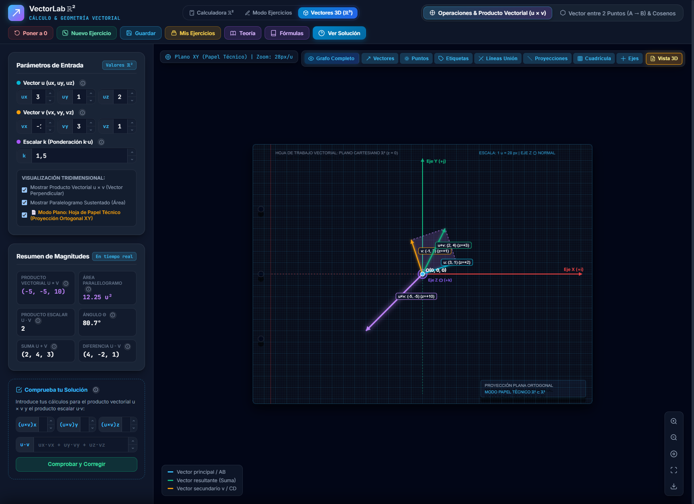 |
| **Espacio 3D: Modo Calculadora Interactiva** | 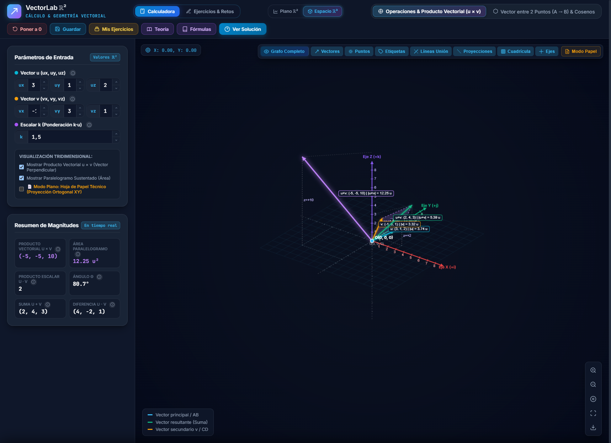 |
| **Espacio 3D: Modo Ejercicios & Autoevaluación** | 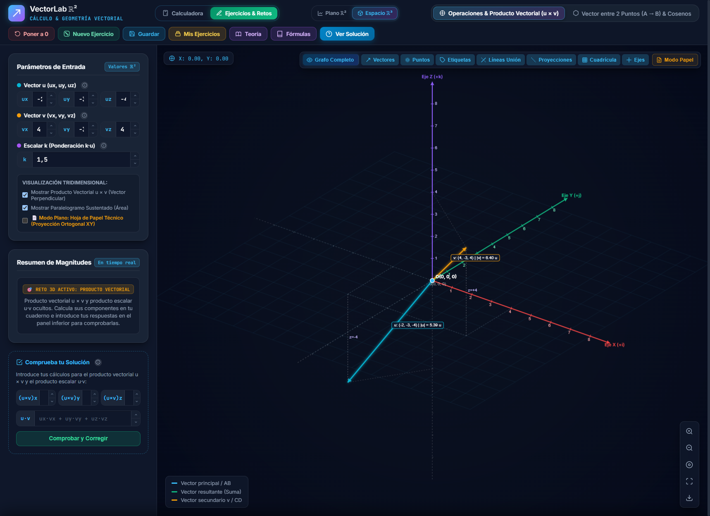 |

---

## 🏗️ Arquitectura del Sistema

El proyecto sigue una arquitectura **Hexagonal / Clean Architecture** guiada por **Domain-Driven Design (DDD)** e inyección de dependencias (IoC), garantizando desacoplamiento total entre las reglas matemáticas y los detalles de renderizado o persistencia:

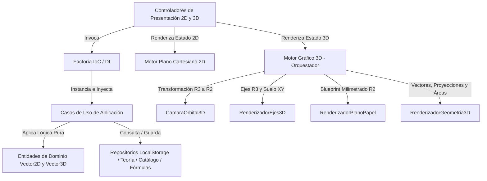

### 📂 Estructura de Directorios

```plaintext
CalculadoraVectores/
├── css/
│   ├── abstracts/
│   │   ├── variables.css          # Variables de diseño, colores HSL y espaciados
│   │   └── animations.css         # Keyframes y transiciones de alto rendimiento
│   ├── base/
│   │   └── reset.css              # Reset universal y normalización de box-sizing
│   ├── components/                # Arquitectura CSS Component-Driven (7-1 Pattern)
│   │   ├── buttons.css            # Botones primarios, secundarios, toggles e iconos
│   │   ├── cards.css              # Contenedores de formularios, badges y métricas
│   │   ├── drawer.css             # Cajón deslizante del solucionario paso a paso
│   │   ├── evaluacion.css         # Tarjetas de autoevaluación en modo ejercicios
│   │   ├── forms.css              # Inputs de coordenadas, pares numéricos y radios
│   │   ├── hud.css                # Controles flotantes multicapa del canvas
│   │   ├── modals.css             # Modales de fórmulas y diálogos de información
│   │   ├── popover-info.css       # Tarjeta flotante y botón 'ℹ' de ayuda contextual
│   │   ├── storage.css            # Modal de ejercicios guardados en LocalStorage
│   │   ├── teoria.css             # Modal interactivo con visor de conceptos y buscador
│   │   └── toast.css              # Sistema de notificaciones toast flotantes
│   ├── layout/
│   │   └── layout.css             # Grid principal (sidebar, canvas, header, footer)
│   └── main.css                   # Índice unificado de hojas de estilo
├── js/
│   ├── core/
│   │   ├── di/
│   │   │   └── FactoriaControladores.js  # Contenedor IoC / Factory de dependencias
│   │   ├── enums/                 # Enums: Modos de app, capas de visualización
│   │   └── types/                 # Interfaces de tipos y contratos de datos
│   ├── features/
│   │   ├── cadena/                # Dominio, casos de uso y UI de cadena de puntos
│   │   ├── operaciones/           # Dominio, casos de uso y UI de álgebra vectorial
│   │   ├── equipolencia/          # Dominio, casos de uso y UI de equipolencia
│   │   ├── ejercicios/            # Dominio, verificación y persistencia LocalStorage
│   │   ├── teoria/                # Repositorio conceptual, catálogo contextual y popover
│   │   └── espacio-3d/            # Dominio, entidades R3, casos de uso y controladores 3D
│   ├── layout/                    # HUD adaptativo y barra de navegación de modos
│   ├── shared/
│   │   ├── canvas/
│   │   │   ├── PlanoCartesiano.js # Motor gráfico del plano euclídeo 2D
│   │   │   ├── MotorGrafico3D.js  # Fachada y orquestador maestro del Canvas 3D
│   │   │   └── motor3d/           # Submódulos especializados del motor tridimensional
│   │   │       ├── CamaraOrbital3D.js        # Ángulos Yaw/Pitch, zoom y proyección esférica
│   │   │       ├── RenderizadorEjes3D.js     # Ejes espaciales y graduación métrica
│   │   │       ├── RenderizadorPlanoPapel.js # Plano técnico de ingeniería milimetrado
│   │   │       └── RenderizadorGeometria3D.js# Vectores, cotas, áreas y símbolos perpendiculares
│   │   └── utils/                 # Utilidades de DOM y generador de campos numéricos
│   └── main.js                    # Bootstrapper y orquestador del ciclo de vida
├── docs/                          # Recursos visuales y documentación técnica
│   └── img/                       # Capturas de pantalla de la suite completa
├── .gitignore                     # Reglas de exclusión para Git
├── index.html                     # Punto de entrada de la aplicación
├── LICENSE                        # Licencia MIT
└── README.md                      # Documentación principal
```

---

## 📐 Formulaciones Matemáticas Implementadas

| Concepto | Expresión Matemática | Implementación en Código |
| :--- | :--- | :--- |
| **Vector entre 2 Puntos (ℝ²)** | $\vec{v} = (x_B - x_A, y_B - y_A)$ | `Vector2D.desdePuntos(origen, destino)` |
| **Módulo (Norma Euclídea ℝ²)** | $\|\vec{v}\| = \sqrt{v_x^2 + v_y^2}$ | `Vector2D.calcularModulo()` |
| **Ángulo Director** | $\theta = \operatorname{atan2}(v_y, v_x)$ | `Vector2D.calcularAnguloGrados()` |
| **Vector Unitario** | $\hat{u} = \left(\frac{v_x}{\|\vec{v}\|}, \frac{v_y}{\|\vec{v}\|}\right)$ | `Vector2D.calcularUnitario()` |
| **Suma / Resta de Vectores** | $\vec{u} \pm \vec{v} = (u_x \pm v_x, u_y \pm v_y)$ | `Vector2D.sumar()` / `restar()` |
| **Producto Escalar (Dot)** | $\vec{u} \cdot \vec{v} = u_x v_x + u_y v_y = \|\vec{u}\|\|\vec{v}\|\cos\theta$ | `Vector2D.productoEscalar()` |
| **Ángulo entre Vectores** | $\theta = \arccos\left(\frac{\vec{u} \cdot \vec{v}}{\|\vec{u}\| \|\vec{v}\|}\right)$ | `Vector2D.calcularAnguloEntre()` |
| **Equipolencia** | $\|\vec{u}\| = \|\vec{v}\| \land \hat{u} = \hat{v}$ | `EvaluarEquipolenciaUseCase.ejecutar()` |
| **Producto Vectorial (Cruz en ℝ³)** | $\vec{u} \times \vec{v} = \begin{vmatrix} \hat{i} & \hat{j} & \hat{k} \\ u_x & u_y & u_z \\ v_x & v_y & v_z \end{vmatrix}$ | `Vector3D.productoCruz()` |
| **Área del Paralelogramo** | $\text{Área} = \|\vec{u} \times \vec{v}\|$ | `Vector3D.calcularAreaParalelogramo()` |
| **Cosenos Directores (ℝ³)** | $\cos\alpha = \frac{v_x}{\|\vec{v}\|}, \cos\beta = \frac{v_y}{\|\vec{v}\|}, \cos\gamma = \frac{v_z}{\|\vec{v}\|}$ | `Vector3D.calcularCosenosDirectores()` |
| **Identidad Pitagórica 3D** | $\cos^2\alpha + \cos^2\beta + \cos^2\gamma = 1$ | `VerificarCosenosDirectoresUseCase` |

---

## 🚀 Puesta en Marcha / Instalación Local

Al ser una aplicación 100% nativa construida sobre estándares web modernos (ES Modules), no requiere ningún proceso de compilación, transpilación ni instalación de paquetes externos.

### Opción 1: Con Python (Cualquier Sistema Operativo)
```bash
# Clonar el repositorio
git clone https://github.com/jucagolddev/CalculadoraVectores.git

# Entrar en la carpeta
cd CalculadoraVectores

# Iniciar servidor HTTP local
python -m http.server 8080
```
Abrir `http://localhost:8080` en cualquier navegador moderno.

### Opción 2: Con XAMPP / Apache
1. Clonar o copiar el repositorio dentro de `htdocs`:
   ```bash
   git clone https://github.com/jucagolddev/CalculadoraVectores.git c:\xampp\htdocs\CalculadoraVectores
   ```
2. Iniciar el servicio **Apache** desde el Panel de Control de XAMPP.
3. Acceder en el navegador a `http://localhost/CalculadoraVectores/`.

### Opción 3: Con VS Code Live Server
1. Abrir la carpeta `CalculadoraVectores` en Visual Studio Code.
2. Hacer clic derecho sobre `index.html` y seleccionar **"Open with Live Server"**.

---

## 🌐 Compatibilidad y Estándares

- **Navegadores Soportados:** Chrome / Chromium (v90+), Firefox (v88+), Edge (v90+), Safari (v15+).
- **Tipografía y Renderizado:** Sanitización total de glifos matemáticos estándar UTF-8 sin caracteres inestables o dependientes de fuentes propietarias.
- **Rendimiento Gráfico:** Canvas 2D acelerado por hardware con escalado adaptable a pantallas HiDPI / Retina (`window.devicePixelRatio`).

---

## 👤 Autor

**Juan Carlos Dorado López**
- GitHub: [@jucagolddev](https://github.com/jucagolddev)
- Portafolio: [Portafolio de Ingeniería Inmersiva](https://github.com/jucagolddev/Portfolio)

---

## 📄 Licencia

Este proyecto está distribuido bajo la Licencia **MIT**. Consulta el archivo [LICENSE](LICENSE) para más información.
